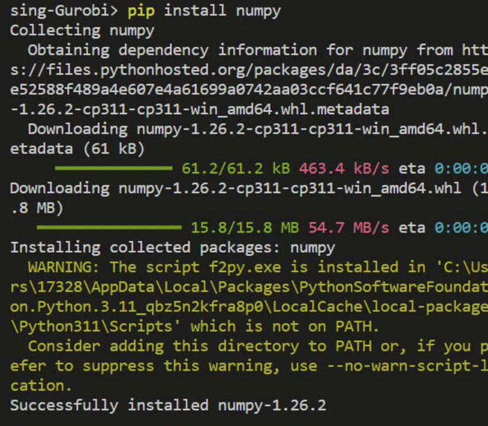
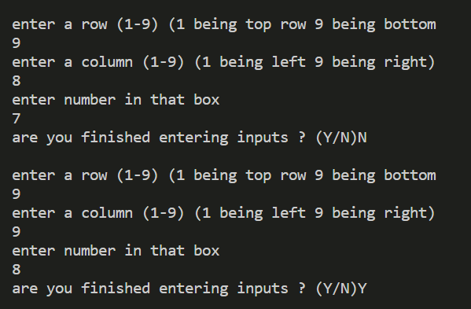
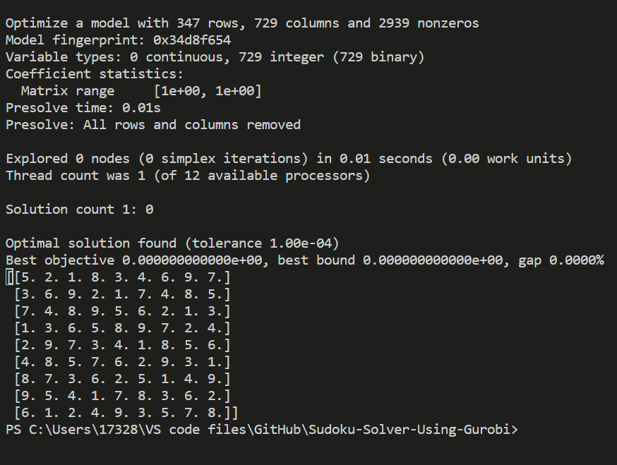

# Sudoku-Solver-Using-Gurobi

# Before running the code
Please remember to install Gurobipy and Numpy before running
To do this type in the terminal 'pip install numpy' and hit enter like shown in the image
Then to install gurobi type 'pip install gurobi' into the same terminal and hit enter

Once finished installing you can run the code

# Running the Code

Enter the row column and number for every box with given numbers into the terminal when prompted. Once finished the code will print a solved sudoku grid. Gurobipy and Numpy must be installed for the code to work. It uses the numpy and Gurobi library

Example of Using the Code

Entering inputs

Solution
